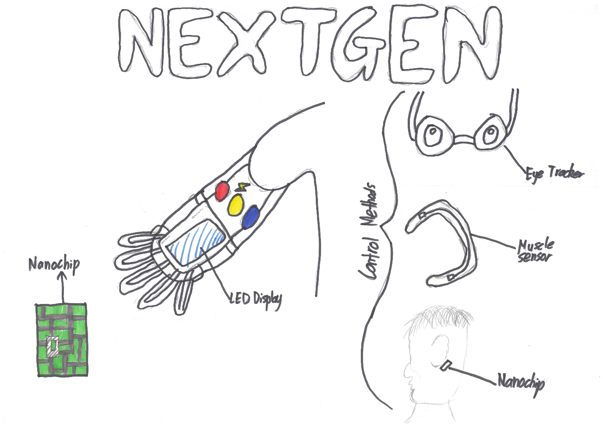
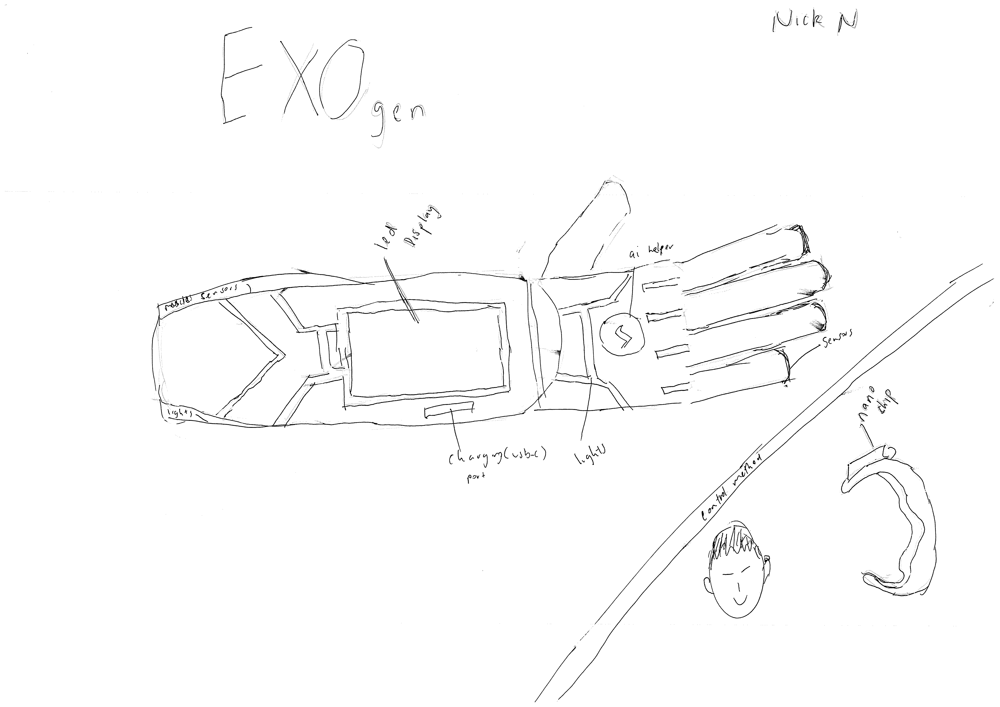

# Rex.L_Nick.N_BioArm

## Our Design

We designed a prototype prosthetic arm to fit the needs of our patient; Aaron. Aaron required a prosthetic arm with features able to fit the needs of rock climbing. In our design, we integrated a distance sensor with servo motors, to simulate the functonality of a real prosthetic. As the distance to an object gets smaller, the servo motors will close and simulate grabbing that object. We were unable to finish some components of our proposed design, such as the OLED display, physical fingers, and different ways on controlling hand and finger movements. 

## Components

* 5x Servo Motors
* Ultrasonic Distance Sensor
* OLED Display (Work in Progress)

## Functions

* Arm gradually closing based on distance
* OLED display showing the distance to objects (WIP)
* Different control methods (WIP)

## Pictorials

